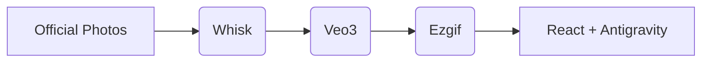

# River Indie - Demo Website

This is a visually engaging demo website created for the River Indie electric scooter. This project was developed entirely for fun and as a creative exercise.

**[🚀 View Live Demo](https://river-indie-demo.vercel.app)**

**Disclaimer:** This is a non-commercial project created for educational and creative purposes. The official imagery of the River Indie was used as a reference for a generative pipeline involving Whisk and Google Veo 3. Videos were processed into frame-sequences via Ezgif. This platform was architected using Antigravity. Concept & Orchestration by Hareesh V. Not affiliated with River Mobility Pvt. Ltd.

## Credits & Creative Process

The creation of this website involved a blend of imagination and various AI & web tools:

*   **Original Inspiration:** The official images of the River Indie bikes available online were used as the base reference.
*   **Image Generation:** Used **Whisk** to create the initial concept art and a group of bike images.
*   **Video Generation:** Converted the images generated by Whisk into dynamic videos using **Veo3**.
*   **Frame Extraction:** Used **Ezgif** to convert the videos generated by Veo3 into frame-by-frame image sequences.
*   **Website Development:** The platform was architected using **Antigravity (AI)**.
*   **Concept & Orchestration:** Hareesh V.

## Visual Pipeline

## Technologies Used

*   React
*   Tailwind CSS
*   Vite
*   Whisk (Image Generation)
*   Veo3 (Video Generation)
*   Ezgif (Frame Extraction)
*   Antigravity AI (Code Generation)

## How to run locally

1.  Clone the repository.
2.  Run `npm install` to install dependencies.
3.  Run `npm run dev` to start the development server.

---
*Designed & Conceptualized by Hareesh V.*
